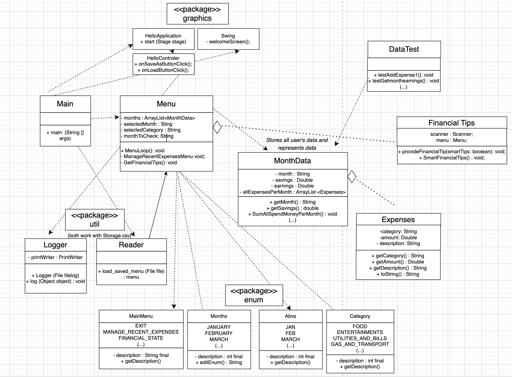
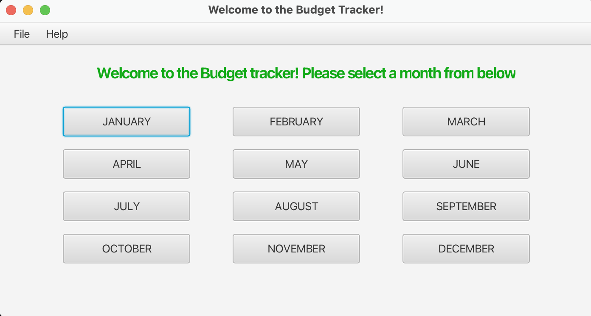
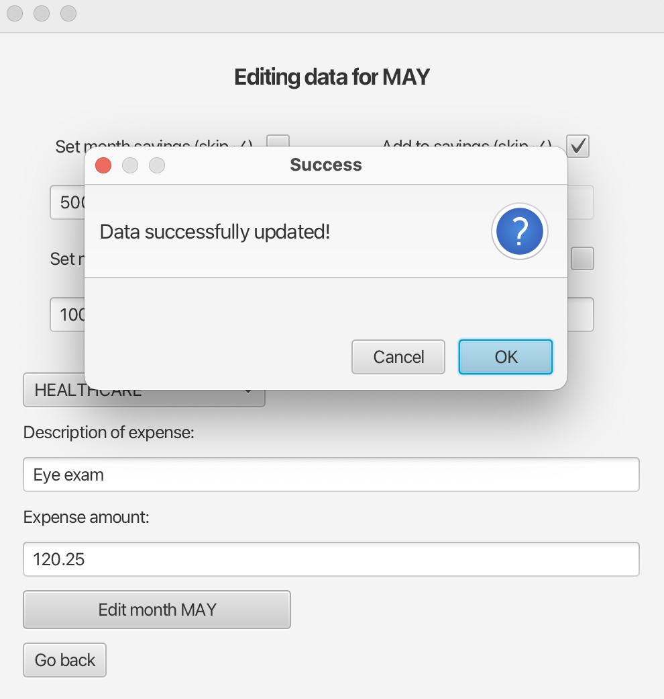
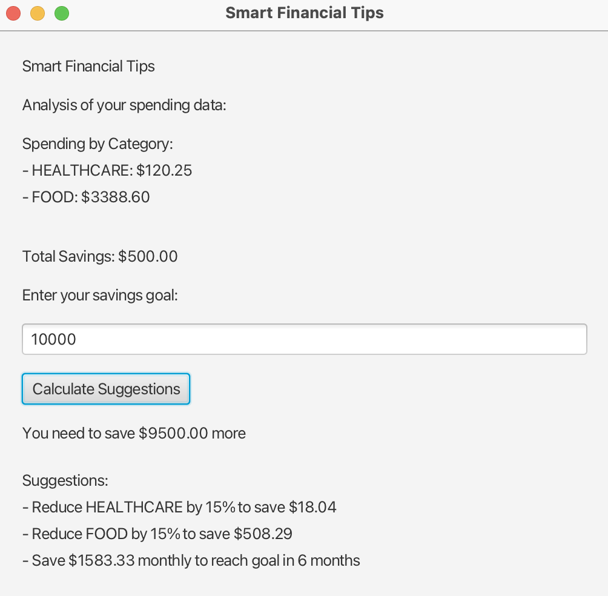

# Java Budget Tracker

Java Budget Tracker — desktop application for tracking expenses, savings, and earnings throughout the year.  
Features include:
- Monthly expense and savings management
- Savings goal tracking
- Simple financial tips display
- GUI built with Scene Builder and Java code

## Project Structure (UML)
The architecture of the project is shown in the UML diagram:  

## Screenshots

**Main Menu**  

**Editing Monthly Data**  

**Financial Tips**  

## How to run
1. Open the project in IntelliJ IDEA (or any Java IDE).  
2. Run the `Main` class from the `src` folder.  

*(This project was developed as part of a group coursework project at the University of Calgary.)*
